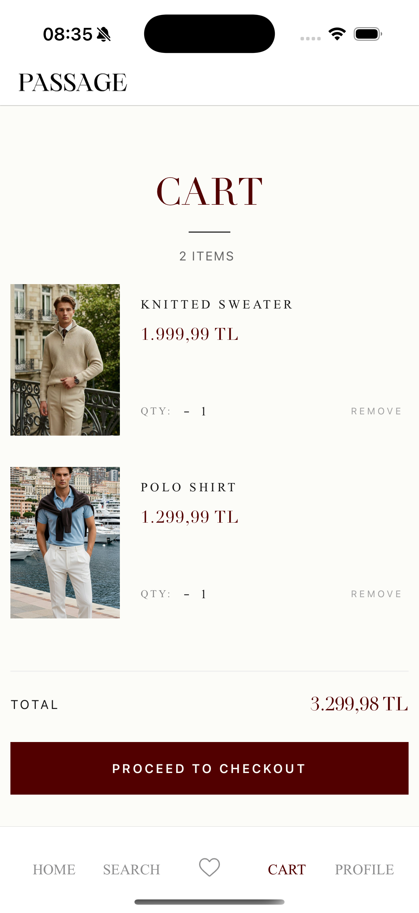
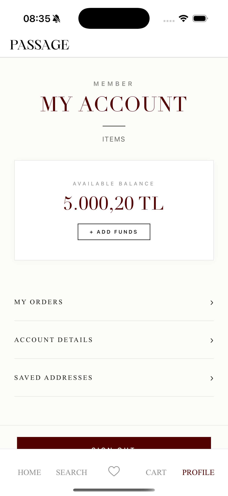

# TradeFlow Mobile Client

A premium, cross-platform mobile e-commerce application engineered with **React Native**. This project serves as the client-side interface for the **TradeFlow Ecosystem**, delivering a seamless shopping experience with high-performance user interactions.

The application is fully integrated with the **SpringTradeFlow** backend architecture, ensuring real-time data synchronization, secure transaction processing, and dynamic content management controlled directly via the TradeFlow Admin Panel.

## 📱 UI Showcase

| Member Access | Collection Home | Discovery & Filter | Catalogue Results |
| :---: | :---: | :---: | :---: |
|  |  |  |  |

| Product Detail | Active Cart | Wishlist / Favorites | User Profile |
| :---: | :---: | :---: | :---: |
|  |  |  |  |

## 🏗 System Architecture & Integration

This mobile client operates as a head for the headless commerce architecture provided by **SpringTradeFlow**.

### Backend Integration (SpringTradeFlow)
* **Real-Time Data Streaming:** Utilizes optimized RESTful endpoints to fetch catalog data, user profiles, and order history with minimal latency.
* **Active Order Creation & Email Tracking:** End-to-end checkout flow allowing users to create active orders. Asynchronous email notifications (powered by event-driven backend architecture) provide instant order confirmation and tracking capabilities.
* **Synchronized Inventory:** Stock levels and product availability are updated instantly across the mobile app as changes occur in the warehouse or via the Admin Panel.
* **Secure Authentication:** Implements JWT-based authentication flows for secure session management and user data protection.

### Admin Panel Control
* **Dynamic Management:** All banners, featured collections (e.g., "Gentlemen/Ladies"), and trending tags visible in the mobile app are configurable in real-time from the Admin Panel.
* **Order Lifecycle:** Orders placed via the mobile app are immediately reflected in the Admin Dashboard for processing and fulfillment.

## 🛠 Technical Stack & Features

### Core Technologies
* **Framework:** React Native (CLI)
* **Language:** JavaScript / ES6+

### Key Implementations
* **Context API for Global State:** Comprehensive state management utilizing React Context API for Authentication (`AuthProvider`), Cart operations (`CartContext`), and Favorites (`FavoriteContext`), ensuring seamless and synchronous data flow across the app without prop drilling.
* **Cart & Wishlist Functionality:** Fully functional cart system and a dedicated favorites (wishlist) screen for users to manage their desired products.
* **Optimistic UI:** Instant visual feedback for user actions (e.g., "Add to Wishlist" or "Add to Cart") while processing background API requests to enhance perceived performance.
* **Advanced Networking:**
    * **Axios Interceptors:** Centralized request/response handling, error management, and automated JWT token injection.
    * **QS (Query String):** Handling complex filtering parameters for search results seamlessly.

---
*This project is proprietary software belonging to the TradeFlow Ecosystem.*